# Skill/Agent 문서 참조 맵

이 문서는 각 Skill과 Agent가 참조하는 문서를 Mermaid 다이어그램으로 시각화합니다.

---

## 1. spec-it (Master Router)

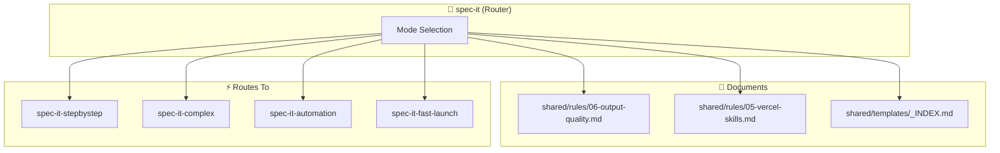

---

## 2. spec-it-stepbystep

```mermaid
flowchart TB
    subgraph skill_sbs["🎯 spec-it-stepbystep"]
        S1[Chapter-by-Chapter Mode]
    end

    subgraph docs_sbs["📄 Documents"]
        D1[shared/output-rules.md]
        D2[shared/context-rules.md]
        D3[shared/rules/50-question-policy.md]
        D4[shared/rules/06-output-quality.md]
        D5[shared/templates/*]
        D6[shared/references/yaml-ui-frame/*]
    end

    subgraph agents_sbs["🤖 Agents"]
        A1[design-interviewer]
        A2[ui-architect]
        A3[component-auditor]
        A4[component-builder]
        A5[component-migrator]
        A6[critical-reviewer]
        A7[ambiguity-detector]
        A8[persona-architect]
        A9[test-spec-writer]
        A10[spec-assembler]
    end

    S1 --> D1
    S1 --> D2
    S1 --> D3
    S1 --> D4
    S1 --> D5
    S1 --> D6
    S1 --> A1
    S1 --> A2
    S1 --> A3
    S1 --> A4
    S1 --> A5
    S1 --> A6
    S1 --> A7
    S1 --> A8
    S1 --> A9
    S1 --> A10
```

---

## 3. spec-it-complex

```mermaid
flowchart TB
    subgraph skill_cx["🎯 spec-it-complex"]
        S1[Hybrid 4-Milestone Mode]
    end

    subgraph docs_cx["📄 Documents"]
        D1[shared/output-rules.md]
        D2[shared/context-rules.md]
        D3[shared/rules/50-question-policy.md]
        D4[shared/templates/*]
    end

    subgraph agents_cx["🤖 Agents"]
        A1[design-interviewer]
        A2[divergent-thinker]
        A3[chapter-planner]
        A4[ui-architect]
        A5[component-auditor]
        A6[component-builder]
        A7[component-migrator]
        A8[critical-reviewer]
        A9[ambiguity-detector]
        A10[persona-architect]
        A11[test-spec-writer]
        A12[spec-assembler]
    end

    S1 --> D1
    S1 --> D2
    S1 --> D3
    S1 --> D4
    S1 --> A1
    S1 --> A2
    S1 --> A3
    S1 --> A4
    S1 --> A5
    S1 --> A6
    S1 --> A7
    S1 --> A8
    S1 --> A9
    S1 --> A10
    S1 --> A11
    S1 --> A12
```

---

## 4. spec-it-automation

```mermaid
flowchart TB
    subgraph skill_auto["🎯 spec-it-automation"]
        S1[Full Auto Mode]
    end

    subgraph docs_auto["📄 Documents"]
        D1[shared/output-rules.md]
        D2[shared/context-rules.md]
        D3[shared/templates/*]
    end

    subgraph agents_auto["🤖 Agents"]
        A1[design-interviewer]
        A2[divergent-thinker]
        A3[critic-logic]
        A4[critic-feasibility]
        A5[critic-frontend]
        A6[critic-moderator]
        A7[chapter-planner]
        A8[ui-architect]
        A9[component-auditor]
        A10[component-builder]
        A11[critical-reviewer]
        A12[ambiguity-detector]
        A13[persona-architect]
        A14[test-spec-writer]
        A15[spec-assembler]
    end

    S1 --> D1
    S1 --> D2
    S1 --> D3
    S1 --> A1
    S1 --> A2
    S1 --> A3
    S1 --> A4
    S1 --> A5
    S1 --> A6
    S1 --> A7
    S1 --> A8
    S1 --> A9
    S1 --> A10
    S1 --> A11
    S1 --> A12
    S1 --> A13
    S1 --> A14
    S1 --> A15
```

---

## 5. spec-it-fast-launch

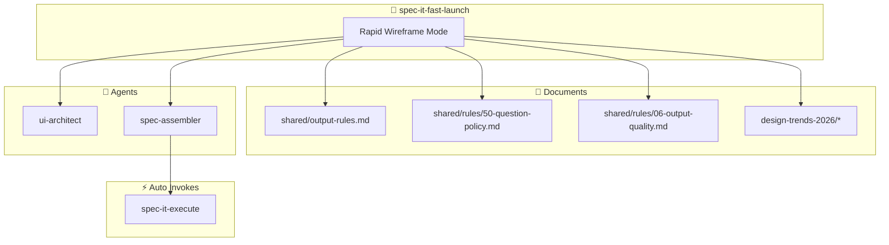

---

## 6. spec-change

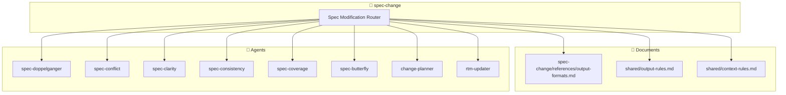

---

## 7. hack-2-spec

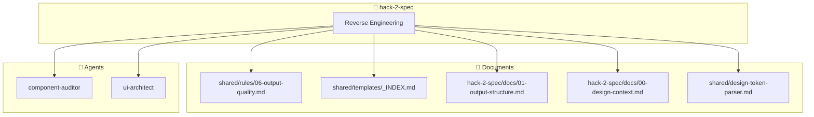

---

## 8. spec-mirror

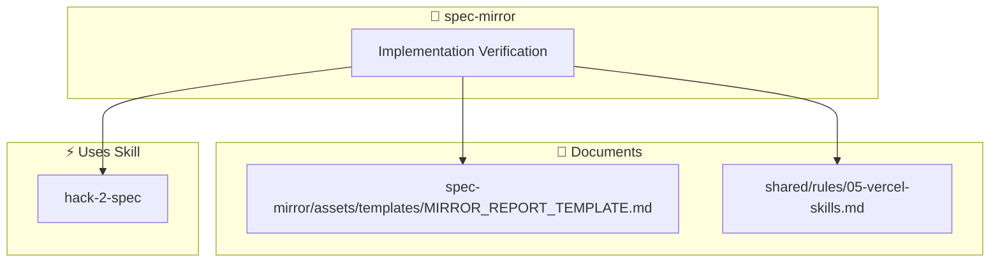

---

## 9. spec-it-api-mcp

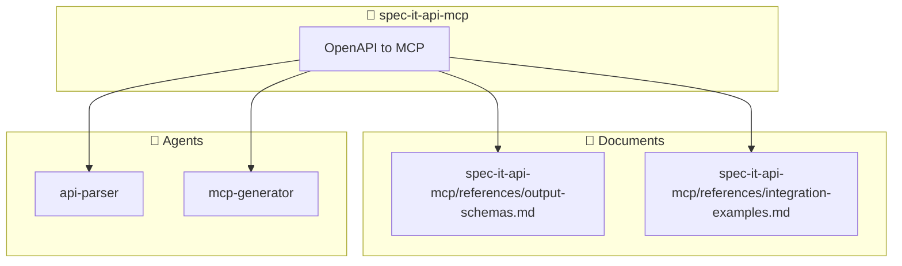

---

## 10. spec-wireframe-edit

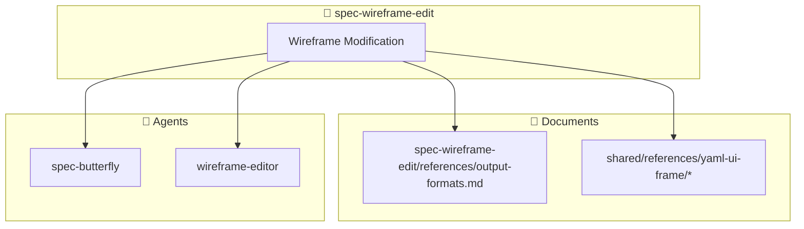

---

## 11. init-spec-md

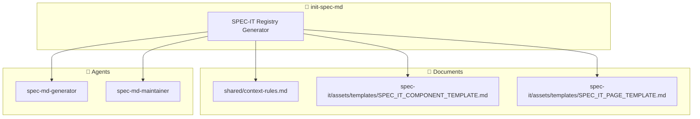

---

## 12. stitch-convert (MCP Tool 기반)

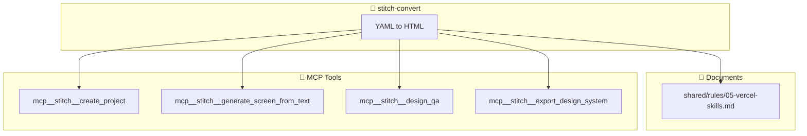

---

## 13. design-trends-2026 (참조 전용)

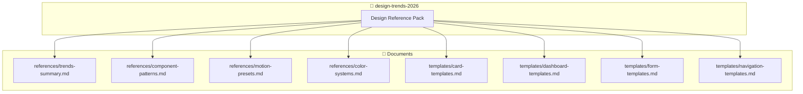

---

## 14. spec-it-mock

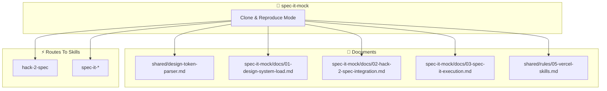

---

## 15. Loader Skills

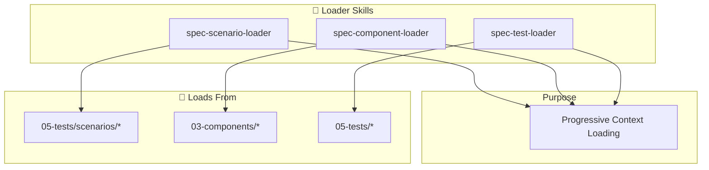

---

# 전체 Skill → Agent 호출 매트릭스

```mermaid
flowchart LR
    subgraph Skills["Skills"]
        S1[spec-it-stepbystep]
        S2[spec-it-complex]
        S3[spec-it-automation]
        S4[spec-it-fast-launch]
        S5[spec-change]
        S6[hack-2-spec]
        S7[spec-wireframe-edit]
        S8[spec-it-api-mcp]
        S9[init-spec-md]
    end

    subgraph CoreAgents["Core Agents"]
        A1[design-interviewer]
        A2[ui-architect]
        A3[spec-assembler]
        A4[persona-architect]
    end

    subgraph ComponentAgents["Component Agents"]
        A5[component-auditor]
        A6[component-builder]
        A7[component-migrator]
    end

    subgraph CriticAgents["Critic Agents"]
        A8[critical-reviewer]
        A9[ambiguity-detector]
        A10[divergent-thinker]
        A11[critic-logic]
        A12[critic-feasibility]
        A13[critic-frontend]
        A14[critic-moderator]
    end

    subgraph ChangeAgents["Change Analysis"]
        A15[spec-doppelganger]
        A16[spec-conflict]
        A17[spec-clarity]
        A18[spec-consistency]
        A19[spec-coverage]
        A20[spec-butterfly]
        A21[change-planner]
        A22[rtm-updater]
    end

    subgraph SpecialAgents["Special Purpose"]
        A23[wireframe-editor]
        A24[api-parser]
        A25[mcp-generator]
        A26[spec-md-generator]
        A27[spec-md-maintainer]
        A28[test-spec-writer]
        A29[chapter-planner]
    end

    S1 --> A1 & A2 & A3 & A4 & A5 & A6 & A7 & A8 & A9 & A28
    S2 --> A1 & A2 & A3 & A4 & A5 & A6 & A7 & A8 & A9 & A10 & A28 & A29
    S3 --> A1 & A2 & A3 & A4 & A5 & A6 & A8 & A9 & A10 & A11 & A12 & A13 & A14 & A28 & A29
    S4 --> A2 & A3
    S5 --> A15 & A16 & A17 & A18 & A19 & A20 & A21 & A22
    S6 --> A5 & A2
    S7 --> A20 & A23
    S8 --> A24 & A25
    S9 --> A26 & A27
```

---

# 미호출 Agent 리스트

다음 에이전트들은 **어떤 skill에서도 호출되지 않습니다**:

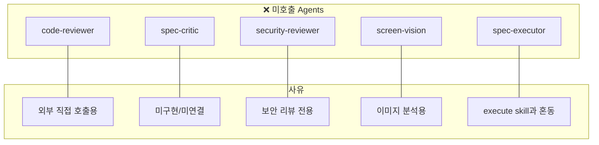

| Agent | 설명 | 비고 |
|-------|------|------|
| `code-reviewer` | Expert code reviewer | PR 리뷰 전용 - skill 외부에서 직접 호출 |
| `spec-critic` | Work plan critic | 내부적으로 사용되지 않음 |
| `security-reviewer` | Security audit (OWASP) | 내부적으로 사용되지 않음 |
| `screen-vision` | Visual analyzer for screenshots | 내부적으로 사용되지 않음 |
| `spec-executor` | Complex multi-file task executor | 내부적으로 사용되지 않음 (spec-it-execute와 다름) |

---

# Skill 간 호출 관계

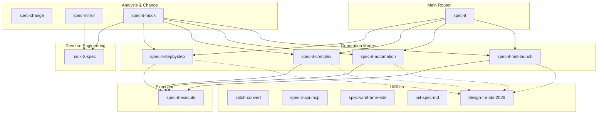

---

## 변경 이력

| 버전 | 날짜 | 작성자 | 변경 내용 |
|------|------|--------|----------|
| 1.0 | 2026-02-03 | Claude | 초안 작성 |
