# Skill/Agent 문서 참조 맵

각 Skill이 참조하는 문서와, 호출하는 Agent/Skill이 참조하는 문서까지 전체 체인을 포함합니다.

---

## 1. spec-it-stepbystep

```mermaid
flowchart TB
    subgraph SKILL["🎯 spec-it-stepbystep"]
        S1[Step-by-Step Mode]
    end

    subgraph SKILL_DOCS["📄 Skill 직접 참조"]
        SD1[shared/output-rules.md]
        SD2[shared/context-rules.md]
        SD3[shared/rules/50-question-policy.md]
        SD4[shared/rules/06-output-quality.md]
        SD5[shared/templates/_INDEX.md]
    end

    subgraph AGENT_DI["🤖 design-interviewer"]
        A1[Agent: Q&A Conductor]
    end

    subgraph AGENT_UI["🤖 ui-architect"]
        A2[Agent: Wireframe Generator]
    end
    subgraph UI_DOCS["📄 ui-architect 참조"]
        UD1[yaml-ui-frame/01-basic-structure.md]
        UD2[yaml-ui-frame/02-grid-definition.md]
        UD3[yaml-ui-frame/03-components.md]
        UD4[yaml-ui-frame/07-design-direction.md]
        UD5[design-trends-2026/references/trends-summary.md]
        UD6[design-trends-2026/references/component-patterns.md]
        UD7[design-trends-2026/templates/navigation-templates.md]
        UD8[assets/templates/LAYOUT_TEMPLATE.yaml]
        UD9[shared/design-tokens.yaml]
    end

    subgraph AGENT_CA["🤖 component-auditor"]
        A3[Agent: Component Scanner]
    end

    subgraph AGENT_CB["🤖 component-builder"]
        A4[Agent: Component Spec Writer]
    end
    subgraph CB_DOCS["📄 component-builder 참조"]
        CBD1[assets/templates/COMPONENT_SPEC_TEMPLATE.yaml]
        CBD2[shared/design-tokens.yaml]
    end

    subgraph AGENT_CM["🤖 component-migrator"]
        A5[Agent: Migration Planner]
    end

    subgraph AGENT_CR["🤖 critical-reviewer"]
        A6[Agent: Spec Reviewer]
    end

    subgraph AGENT_AD["🤖 ambiguity-detector"]
        A7[Agent: Ambiguity Finder]
    end

    subgraph AGENT_PA["🤖 persona-architect"]
        A8[Agent: Persona Creator]
    end

    subgraph AGENT_TS["🤖 test-spec-writer"]
        A9[Agent: Test Spec Writer]
    end

    subgraph AGENT_SA["🤖 spec-assembler"]
        A10[Agent: Final Assembler]
    end

    S1 --> SD1 & SD2 & SD3 & SD4 & SD5
    S1 --> A1 & A2 & A3 & A4 & A5 & A6 & A7 & A8 & A9 & A10

    A2 --> UD1 & UD2 & UD3 & UD4 & UD5 & UD6 & UD7 & UD8 & UD9
    A4 --> CBD1 & CBD2
```

---

## 2. spec-it-complex

```mermaid
flowchart TB
    subgraph SKILL["🎯 spec-it-complex"]
        S1[Hybrid 4-Milestone Mode]
    end

    subgraph SKILL_DOCS["📄 Skill 직접 참조"]
        SD1[shared/output-rules.md]
        SD2[shared/context-rules.md]
        SD3[shared/rules/50-question-policy.md]
        SD4[shared/templates/_INDEX.md]
    end

    subgraph AGENTS["🤖 Agents"]
        A1[design-interviewer]
        A2[divergent-thinker]
        A3[chapter-planner]
        A4[ui-architect]
        A5[component-auditor]
        A6[component-builder]
        A7[component-migrator]
        A8[critical-reviewer]
        A9[ambiguity-detector]
        A10[persona-architect]
        A11[test-spec-writer]
        A12[spec-assembler]
    end

    subgraph UI_DOCS["📄 ui-architect 참조"]
        UD1[yaml-ui-frame/01-basic-structure.md]
        UD2[yaml-ui-frame/02-grid-definition.md]
        UD3[yaml-ui-frame/03-components.md]
        UD4[yaml-ui-frame/07-design-direction.md]
        UD5[design-trends-2026/references/trends-summary.md]
        UD6[design-trends-2026/references/component-patterns.md]
    end

    subgraph CB_DOCS["📄 component-builder 참조"]
        CBD1[assets/templates/COMPONENT_SPEC_TEMPLATE.yaml]
        CBD2[shared/design-tokens.yaml]
    end

    S1 --> SD1 & SD2 & SD3 & SD4
    S1 --> A1 & A2 & A3 & A4 & A5 & A6 & A7 & A8 & A9 & A10 & A11 & A12

    A4 --> UD1 & UD2 & UD3 & UD4 & UD5 & UD6
    A6 --> CBD1 & CBD2
```

---

## 3. spec-it-automation

```mermaid
flowchart TB
    subgraph SKILL["🎯 spec-it-automation"]
        S1[Full Auto Mode]
    end

    subgraph SKILL_DOCS["📄 Skill 직접 참조"]
        SD1[shared/output-rules.md]
        SD2[shared/context-rules.md]
        SD3[shared/templates/_INDEX.md]
    end

    subgraph CRITIC_AGENTS["🤖 Critic Agents"]
        CA1[critic-logic]
        CA2[critic-feasibility]
        CA3[critic-frontend]
        CA4[critic-moderator]
    end

    subgraph CORE_AGENTS["🤖 Core Agents"]
        A1[design-interviewer]
        A2[divergent-thinker]
        A3[chapter-planner]
        A4[ui-architect]
        A5[component-auditor]
        A6[component-builder]
        A7[critical-reviewer]
        A8[ambiguity-detector]
        A9[persona-architect]
        A10[test-spec-writer]
        A11[spec-assembler]
    end

    subgraph UI_DOCS["📄 ui-architect 참조"]
        UD1[yaml-ui-frame/*.md]
        UD2[design-trends-2026/references/*.md]
    end

    S1 --> SD1 & SD2 & SD3
    S1 --> CA1 & CA2 & CA3 & CA4
    S1 --> A1 & A2 & A3 & A4 & A5 & A6 & A7 & A8 & A9 & A10 & A11

    A4 --> UD1 & UD2
```

---

## 4. spec-it-fast-launch

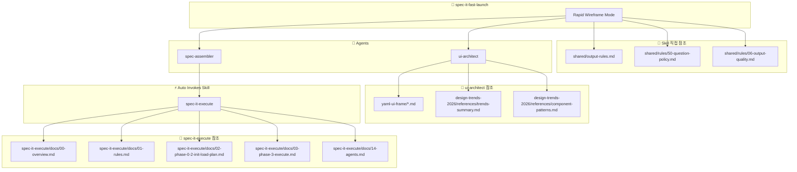

---

## 5. spec-change

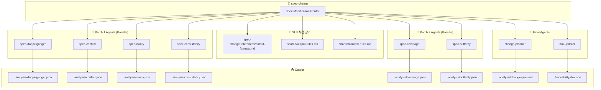

---

## 6. hack-2-spec

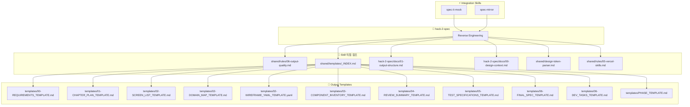

---

## 7. spec-it-api-mcp

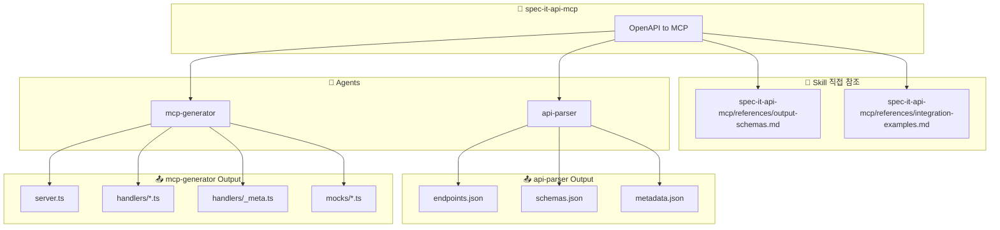

---

## 8. spec-mirror

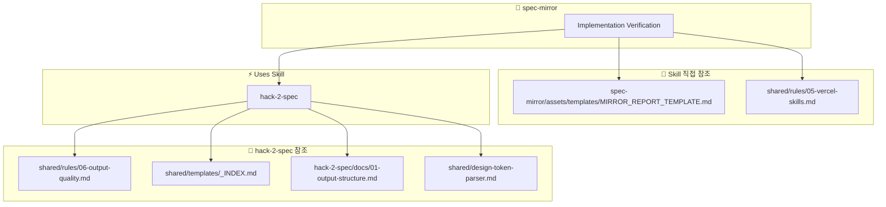

---

## 9. spec-wireframe-edit

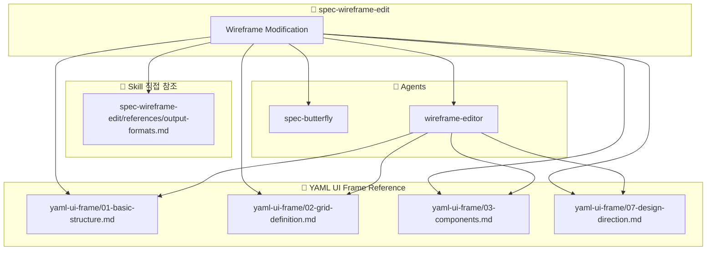

---

## 10. init-spec-md

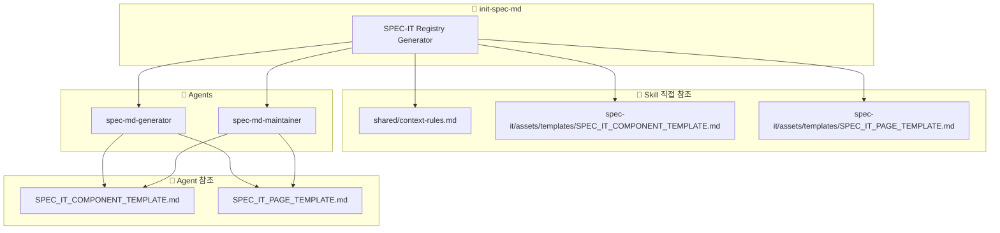

---

## 11. stitch-convert

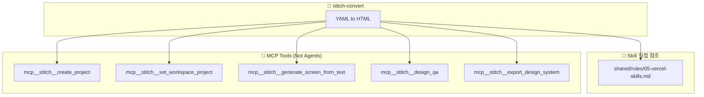

---

## 12. design-trends-2026

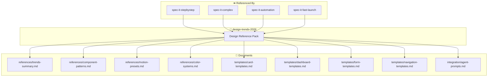

---

## 13. spec-it-mock

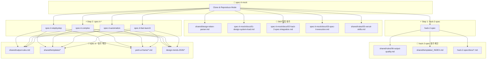

---

# 전체 Skill 호출 그래프

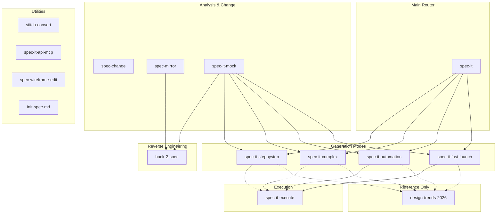

---

# 미호출 Agent 리스트

다음 에이전트들은 **어떤 Skill에서도 직접 호출되지 않습니다**:

| Agent | 설명 | 비고 |
|-------|------|------|
| `code-reviewer` | PR/코드 리뷰 전문가 | 외부에서 직접 호출 전용 |
| `spec-critic` | Work plan 비평가 | 미사용/미구현 |
| `security-reviewer` | 보안 감사 (OWASP) | 미사용/미구현 |
| `screen-vision` | 스크린샷 시각 분석 | 미사용/미구현 |
| `spec-executor` | 복잡한 멀티파일 실행 | spec-it-execute와 혼동 주의 |

---

# 공유 문서 참조 빈도

| 문서 | 참조하는 Skill 수 |
|------|-----------------|
| `shared/rules/06-output-quality.md` | 5+ (거의 모든 생성 Skill) |
| `shared/templates/_INDEX.md` | 4+ (hack-2-spec, spec-it-*) |
| `shared/output-rules.md` | 4+ (모든 spec-it 모드) |
| `shared/rules/05-vercel-skills.md` | 4+ (레이아웃 관련 Skill) |
| `yaml-ui-frame/*.md` | 3+ (ui-architect 사용 Skill) |
| `design-trends-2026/*` | 4 (모든 spec-it 모드) |

---

## 변경 이력

| 버전 | 날짜 | 작성자 | 변경 내용 |
|------|------|--------|----------|
| 1.0 | 2026-02-03 | Claude | 초안 작성 |
| 2.0 | 2026-02-03 | Claude | Agent/Skill 참조 문서 전체 체인 포함 |
