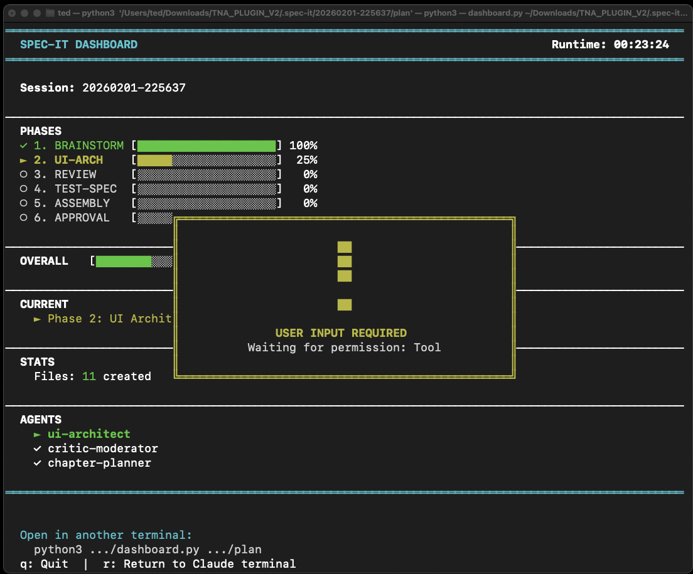
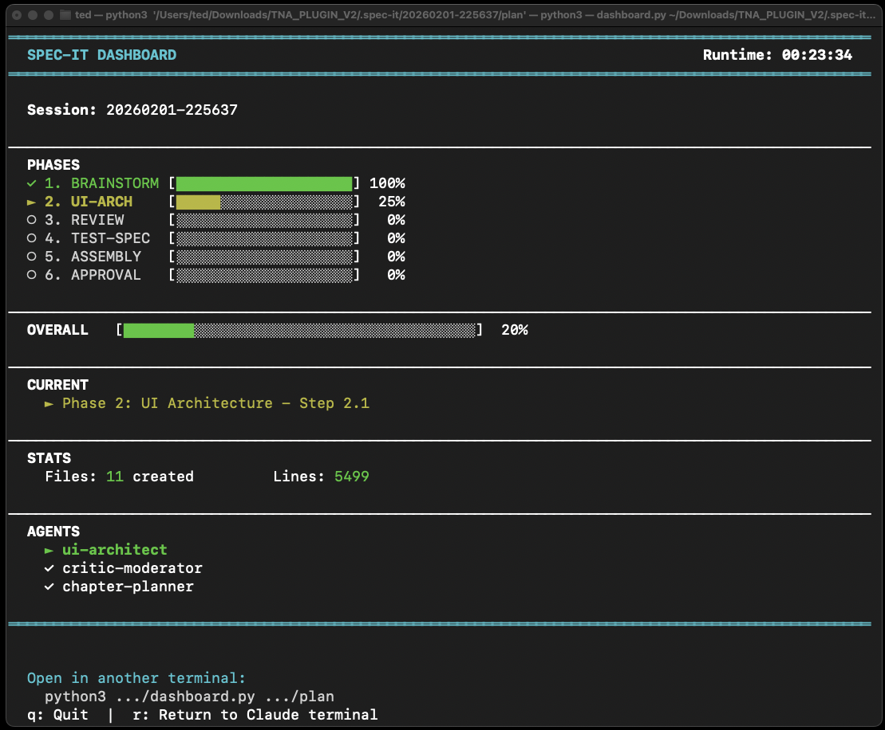

# Frontend Development Process Evolution Report

**프로젝트**: Claude Frontend Skills Plugin
**기준점**: spec-it 최초 도입 (commit 47da285, 2026-01-29 22:09:26 +0900)
**분석 범위**: 80개 커밋 (spec-it 도입 이후)
**분석 일자**: 2026-02-01

---

## Executive Summary

spec-it 도입 이후, 이 플러그인은 **스펙 생성**을 넘어 **자동 구현·검증·관찰**까지 포함하는 End-to-End 프레임워크로 발전했다. 핵심 변화는 YAML 구조화, 컨텍스트 관리 규칙, 실시간 대시보드, spec-it-execute(9단계), 질문 정책(Confirm/Hybrid/Auto)이며, spec-mirror/hack-2-spec/prompt-inspector 등 유틸리티 스킬이 실무 적용성을 높였다.

### 핵심 지표 요약

| 지표 | 초기 spec-it | 현재 시스템 | 개선 |
|------|-------------|-------------|------|
| 에이전트 수 | 15개 | 23+개 | 증가 |
| 스킬 수 | 1개 (통합) | 19개 (분리) | +1800% |
| Critic 패턴 | 단일 (chapter-critic) | Multi-Agent Debate (3+1) | 품질 검증 강화 |
| 대시보드 | 없음 | Python curses (실시간) | 신규 |
| 실행 워크플로우 | 없음 | 9단계 spec-it-execute | 신규 |
| 컨텍스트 관리 | 암묵적 | 명시적 규칙 (600줄, Silent Mode) | 체계화 |
| MCP 통합 | 없음 | Stitch + DevTools | 신규 |

---

## Part 1: 초기 spec-it 분석 (기준점)

### 1.1 초기 spec-it 구조 (commit 47da285)
- spec-it 단일 스킬 중심의 스펙 생성 플로우
- 모드 분화/대시보드/실행 엔진 이전 단계

**기준 커밋**
2026-01-29 22:09:26 +0900 — Add spec-it skill for frontend specification generation (#11)
https://github.com/30eggis/claude-frontend-skills/commit/47da285

### 1.2 초기 spec-it의 워크플로우
```
Phase 0: Input Analysis
    ↓
Phase 1: Design Brainstorming
    ↓
Phase 2: UI Architecture
    ↓
Phase 3: Component Discovery & Migration
    ↓
Phase 4: Critical Review
    ↓
Phase 5: Persona & Scenario Test Spec
    ↓
Phase 6: Final Assembly
```

### 1.3 초기 spec-it의 한계점
| 영역 | 한계 | 영향 |
|------|------|------|
| 검증 | 단일 Critic | 관점 편향 가능성 |
| 컨텍스트 | 관리 규칙 없음 | 대용량 문서에서 중단 빈번 |
| 복구 | 체크포인트만 | 재개 흐름 불완전 |
| 시각화 | 대시보드 없음 | 진행 상황 파악 어려움 |
| 실행 | 스펙 생성까지만 | 구현은 수작업 |

---

## Part 2: 진화 과정 (80 커밋)

### 2.1 Phase 1: 구조/컨텍스트 체계화
- 스킬 분리, 규칙 기반 컨텍스트 관리, 배치 병렬 제약

대표 커밋
2026-01-30 01:19:19 +0900 — Add context management rules and real-time dashboard for spec-it (#12)
https://github.com/30eggis/claude-frontend-skills/commit/b69f904
2026-01-30 01:46:01 +0900 — Update file splitting rules: 600 lines max with unified naming
https://github.com/30eggis/claude-frontend-skills/commit/8008287

### 2.2 Phase 2: 검증 패턴 고도화
- Multi-Agent Debate 도입으로 품질 검증 구조화

대표 커밋
2026-01-30 08:58:05 +0900 — Add Multi-Agent Debate pattern for critique and optimize parallel execution
https://github.com/30eggis/claude-frontend-skills/commit/966b5bc

### 2.3 Phase 3: MCP/외부 통합
- Stitch, DevTools MCP 연동으로 UI 생성 및 미리보기 자동화

대표 커밋
2026-01-30 09:24:16 +0900 — Add Google Stitch MCP integration for spec-it UI generation
https://github.com/30eggis/claude-frontend-skills/commit/57ee74d
2026-01-30 09:30:55 +0900 — Add Chrome DevTools MCP for live preview during execution
https://github.com/30eggis/claude-frontend-skills/commit/2d8d281

### 2.4 Phase 4: 대시보드/관찰성 강화
- Bash → Python curses 전환, 실행/대기 상태 시각화

대표 커밋
2026-01-31 03:27:33 +0900 — Replace bash dashboard with Python curses version
https://github.com/30eggis/claude-frontend-skills/commit/12d9070
2026-01-31 12:05:14 +0900 — Redesign dashboard with separate SPEC-IT and EXECUTE modes
https://github.com/30eggis/claude-frontend-skills/commit/1265c88

### 2.5 Phase 5: 실행 엔진/게이트 도입
- spec-it-execute 9단계 + QA/Mirror/E2E 하드 게이트

대표 커밋
2026-01-31 16:11:39 +0900 — Add spec-mirror verification loop and test phases to spec-it-execute
https://github.com/30eggis/claude-frontend-skills/commit/1e4e320
2026-02-01 18:01:16 +0900 — Gate execute phases on QA/Mirror/E2E success
https://github.com/30eggis/claude-frontend-skills/commit/063da1b

### 2.6 Phase 6: YAML 표준화/질문 정책
- ASCII → YAML 전환 및 자동화 모드 질문 정책 적용

대표 커밋
2026-01-31 23:13:27 +0900 — Replace ASCII/Stitch wireframes with YAML structured format
https://github.com/30eggis/claude-frontend-skills/commit/06ca60b
2026-02-01 22:02:22 +0900 — Standardize YAML wireframes and enforce hard gates
https://github.com/30eggis/claude-frontend-skills/commit/ef7e60f
2026-02-01 22:27:44 +0900 — Add question policy rules for spec-it modes
https://github.com/30eggis/claude-frontend-skills/commit/1cf7654

---

## Part 3: 현재 시스템 vs 초기 spec-it 비교

### 3.1 구조 비교
| 항목 | 초기 spec-it | 현재 시스템 | 변화 |
|------|-------------|-------------|------|
| 에이전트 | 15개 | 23+개 | + |
| 스킬 | 1개 | 19개 | +18개 |
| 템플릿 | MD 중심 | YAML + MD | 구조화 |
| 스크립트 | 없음 | 23개 (.sh) | 신규 |
| MCP 통합 | 없음 | Stitch + DevTools | 신규 |

### 3.2 워크플로우 비교
```
초기: 스펙 생성 6단계 → [수동 구현]
현재: 스펙 생성 6단계 → spec-it-execute 9단계 → [완성 코드]
```

### 3.3 품질 보장 비교
| 검증 단계 | 초기 spec-it | 현재 시스템 |
|----------|-------------|-------------|
| 스펙 검토 | 단일 Critic | Multi-Agent Debate |
| 모호성 감지 | ambiguity-detector | ambiguity-detector + 질문 정책 |
| 구현 검증 | 없음 | spec-mirror |
| 테스트 | 스펙만 | 자동 구현 + 테스트 |
| 보안 | 없음 | security-reviewer |

---

## Part 4: Skill / Agent / Workflow 소개

### 4.1 Skill 소개 (핵심)
- spec-it: 스펙 생성 라우터 (automation/complex/stepbystep)
- spec-it-execute: 스펙 기반 자동 구현/검증
- spec-mirror: 스펙 vs 구현 비교
- hack-2-spec: 코드베이스 → 스펙 역추론
- prompt-inspector: 시각적 API 바인딩
- spec-change/spec-wireframe-edit: 생성 후 변경 관리

### 4.2 Agent 소개 (핵심)
- 설계/기획: design-interviewer, ui-architect
- 검증: critic-logic/feasibility/frontend + critic-moderator
- 실행/리뷰: spec-executor, code-reviewer, security-reviewer
- 테스트/분석: test-spec-writer, screen-vision

### 4.3 워크플로우 소개
- 스펙 생성: 요구→설계→UI→컴포넌트→리뷰→테스트→조립
- 실행: init→load→plan→execute→QA→mirror→unit→E2E→validate→complete
- 관찰: _status.json 기반 대시보드 실시간 추적




---

## Part 5: 특징 (설계 철학)

### 5.1 컨텍스트 안정성 중심 설계
- 점진적 로딩, 600줄 제한, Silent Mode, 병렬 4개 제한

### 5.2 관찰 가능성과 통제
- 대시보드/상태 추적/하드 게이트(QA/Mirror/E2E)

### 5.3 구조적 문서화
- YAML 와이어프레임으로 구조화, 컴포넌트/레이아웃/상호작용 규격화

### 5.4 실무 적용을 고려한 프레임워크화
- spec-mirror/hack-2-spec/prompt-inspector로 생산/검증/연동 루프 강화

---

## Part 6: 결론

- 현재 포지셔닝: 실무 적용 가능한 프레임워크에 가까운 고도화된 MVP
- 강점: 자동화/검증/관찰성/컨텍스트 관리가 운영 수준으로 정비됨
- 보완점: Claude/MCP/Stitch 의존에 따른 운영 표준화 필요

---

## Appendix A: 핵심 커밋 (spec-it 이후)

2026-01-29 22:09:26 +0900 — Add spec-it skill for frontend specification generation (#11)
https://github.com/30eggis/claude-frontend-skills/commit/47da285
2026-01-30 01:19:19 +0900 — Add context management rules and real-time dashboard for spec-it (#12)
https://github.com/30eggis/claude-frontend-skills/commit/b69f904
2026-01-30 08:58:05 +0900 — Add Multi-Agent Debate pattern for critique and optimize parallel execution
https://github.com/30eggis/claude-frontend-skills/commit/966b5bc
2026-01-30 09:24:16 +0900 — Add Google Stitch MCP integration for spec-it UI generation
https://github.com/30eggis/claude-frontend-skills/commit/57ee74d
2026-01-31 03:27:33 +0900 — Replace bash dashboard with Python curses version
https://github.com/30eggis/claude-frontend-skills/commit/12d9070
2026-01-31 16:11:39 +0900 — Add spec-mirror verification loop and test phases to spec-it-execute
https://github.com/30eggis/claude-frontend-skills/commit/1e4e320
2026-01-31 18:48:47 +0900 — Improve Spec-IT system: YAML format, parallelization, auto-execute
https://github.com/30eggis/claude-frontend-skills/commit/89a6d08
2026-01-31 23:13:27 +0900 — Replace ASCII/Stitch wireframes with YAML structured format
https://github.com/30eggis/claude-frontend-skills/commit/06ca60b
2026-02-01 18:01:16 +0900 — Gate execute phases on QA/Mirror/E2E success
https://github.com/30eggis/claude-frontend-skills/commit/063da1b
2026-02-01 22:27:44 +0900 — Add question policy rules for spec-it modes
https://github.com/30eggis/claude-frontend-skills/commit/1cf7654
